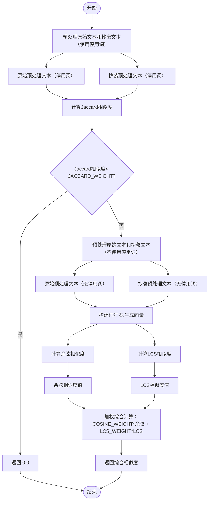

|  这个作业属于哪个课程  |            [23软件工程](https://edu.cnblogs.com/campus/gdgy/SoftwareEngineeringClassof2023)            |
| :--------------------: | :----------------------------------------------------------------------------------------------------: |
| **这个作业要求在哪里** | [【作业2】个人项目](https://edu.cnblogs.com/campus/gdgy/SoftwareEngineeringClassof2023/homework/13324) |
|   **这个作业的目标**   |                         掌握 GitHub 及 Git 的使用方法, 积累个人编程项目的经验                          |

:paperclip:Github链接：[https://github.com/Jue610/Jue610/tree/main/3223004473](https://github.com/Jue610/Jue610/tree/main/3223004473)

### 一、PSP表格
| PSP2.1             | Personal Software Process Stages     | 预估耗时（分钟） | 实际耗时（分钟） |
| ------------------ | ------------------------------------ | ---------------- | ---------------- |
| **Planning**       | 计划                                 | 30               | 30               |
| · Estimate         | 估计这个任务需要多少时间             | 30               | 30               |
| **Development**    | 开发                                 | 380              | 590              |
| · Analysis         | 需求分析 (包括学习新技术)            | 60               | 90               |
| · Design Spec      | 生成设计文档                         | 40               | 30               |
| · Design Review    | 设计复审                             | 30               | 20               |
| · Coding Standard  | 代码规范 (制定开发规范)              | 10               | 10               |
| · Design           | 具体设计                             | 30               | 40               |
| · Coding           | 具体编码                             | 120              | 180              |
| · Code Review      | 代码复审                             | 30               | 40               |
| · Test             | 测试（自我测试，修改代码，提交修改） | 60               | 180              |
| **Reporting**      | 报告                                 | 130              | 260              |
| · Test Report      | 测试报告                             | 90               | 120              |
| · Size Measurement | 计算工作量                           | 10               | 20               |
| · Postmortem       | 事后总结, 并提出过程改进计划         | 30               | 120              |
| **Total**          | 合计                                 | 540              | 880              |


### 二、模块接口的设计与实现过程
- **函数接口**
1. **`read_file`函数**
   - **功能**：用于读取指定路径下的文件内容。如果文件不存在或读取失败，会给出相应提示并终止程序。
   - 相对独立，主要与操作系统的文件系统交互，不依赖于其他自定义函数的内部状态，仅在`main`函数中被调用获取原始文本和抄袭文本。
2. **`preprocess`函数**
   - **功能**：对输入的文本进行预处理，进行结巴分词和去除停用词，可根据参数选择是否使用停用词。
   - 被`hybrid_similarity`函数调用，是计算相似度过程中的一个重要预处理步骤。
3. **`jaccard_similar`、`cosine_similar`、`lcs_similar`函数**
   - **功能**
     - `jaccard_similar`函数用于计算两个集合之间的Jaccard相似度。
     - `cosine_similar`函数用于计算两个向量之间的余弦相似度。
     - `lcs_similar`函数用于计算两个序列之间的最长公共子序列（LCS）相似度。
   - 这三个函数都被`hybrid_similarity`函数调用，是计算综合相似度的子步骤。
4. **`hybrid_similarity`函数**
   - **功能**：计算原始文本和抄袭文本之间的综合相似度，包括Jaccard初筛、构建向量计算余弦相似度和最长公共子序列相似度，最后加权综合得到结果。
   - **与其他函数的关系**：它调用了`preprocess`、`jaccard_similar`、`cosine_similar`和`lcs_similar`函数，是整个相似度计算的核心流程，其结果被`main`函数使用。
5. **`main`函数**
   - **功能**：作为程序的入口点，负责解析命令行参数，调用`read_file`函数获取原始文本和抄袭文本，调用`hybrid_similarity`函数计算相似度，并将结果写入指定的答案文件。
   - 调用了`read_file`和`hybrid_similarity`函数，整合整个程序的主要流程。
- **流程图**：

- **创新点**
1. ==多种算法融合==：使用了Jaccard相似度、余弦相似度和最长公共子序列（LCS）相似度三种不同的算法来衡量文本的相似性。
2. ==停用词处理==：在preprocess函数中提供了灵活的停用词处理方式。可以根据use_stopwords参数决定是否使用停用词表来预处理文本。同时，停用词表可以根据具体需求进行扩展。
### 三、模块接口部分的性能
- 性能分析图：


### 四、模块部分单元测试
- 单元测试覆盖率：


1. `test_same_text`测试用例
- 测试`hybrid_similarity`函数。
- **思路**：构造了完全相同的原始文本和抄袭文本（`orig_text`和`copy_text`都为“这是一个测试文本”）。测试在理想情况下，当两个文本完全相同时，`hybrid_similarity`函数是否能正确返回接近1.0（的相似度。
```python
    def test_same_text(self):
        orig_text = "这是一个测试文本"
        copy_text = "这是一个测试文本"
        similarity = hybrid_similarity(orig_text, copy_text)
        self.assertEqual(round(similarity, 2), 1.00)
```
2. `test_empty_text`测试用例
- 测试`hybrid_similarity`函数。
- **思路**:将原始文本和抄袭文本都设置为空字符串,测试当输入为空文本时，函数是否能正确返回0.00的相似度。这是一种边界情况，用于检查函数在特殊输入下的正确性。
```python
    def test_empty_text(self):
        orig_text = ""
        copy_text = ""
        similarity = hybrid_similarity(orig_text, copy_text)
        self.assertEqual(round(similarity, 2), 0.00)
```

1. `test_only_stopwords_text`测试用例
 - 测试`hybrid_similarity`函数。
- **思路**:构造了仅包含停用词的原始文本和抄袭文本,测试当输入文本几乎没有有效内容时，函数是否能正确返回0.00的相似度，这是一种边界情况测试。
```python
    def test_only_stopwords_text(self):
        orig_text = "的是了"
        copy_text = "的是了"
        similarity = hybrid_similarity(orig_text, copy_text)
        self.assertEqual(round(similarity, 2), 0.00)
```

4.`test_jaccard_not_pass`测试用例
 - 测试`hybrid_similarity`函数。
 - **思路**： 构造了内容差异较大的原始文本和抄袭文本，测试当文本内容差异较大，导致Jaccard初筛不通过（即Jaccard相似度小于`jaccard_weight`）时，函数是否能正确返回0.00的相似度。这是对`hybrid_similarity`函数中Jaccard初筛逻辑测试。
```python
    def test_jaccard_not_pass(self):
        orig_text = "今天天气很好"
        copy_text = "明天天气不好"
        similarity = hybrid_similarity(orig_text, copy_text)
        self.assertEqual(round(similarity, 2), 0.00)
```

5. `test_jaccard_pass_cosine_zero`测试用例
- 测试`hybrid_similarity`函数。
- **思路**：构造了内容不同但有一定相似性的原始文本和抄袭文本，测试当Jaccard初筛通过，但余弦相似度较低的情况下，`hybrid_similarity`函数是否能正确返回小于1.00的相似度，是对`hybrid_similarity`函数中综合相似度计算，特别是余弦相似度部分的逻辑测试。
```python
 def test_jaccard_pass_cosine_zero(self):
        orig_text = "我喜欢苹果"
        copy_text = "我喜欢香蕉"
        similarity = hybrid_similarity(orig_text, copy_text)
        self.assertTrue(similarity < 1.00)
```

6. `test_jaccard_pass_lcs_zero`测试用例
- 测试`hybrid_similarity`函数。
- **思路**： 构造了内容不同的原始文本和抄袭文本，测试当Jaccard初筛通过，但最长公共子序列（LCS）相似度较低时，函数是否能正确返回小于1.00的相似度，是对`hybrid_similarity`函数中综合相似度计算，特别是LCS相似度部分的逻辑测试。
```python
   def test_jaccard_pass_lcs_zero(self):
        orig_text = "红色的花朵"
        copy_text = "蓝色的天空"
        similarity = hybrid_similarity(orig_text, copy_text)
        self.assertEqual(type(similarity), float)
        self.assertTrue(similarity < 1.00)
```

7. `test_cosine_special_case`测试用例
- 测试`hybrid_similarity`函数。
- **思路**：构造了仅包含标点符号的原始文本和抄袭文本，测试在特殊的、几乎没有实际内容的输入下，函数是否能正确返回小于1.00的相似度，是对综合相似度计算逻辑在特殊输入情况下的测试。
```python
    def test_cosine_special_case(self):
        orig_text = "，，，，，，，，，，"
        copy_text = "。。。。。。。。。。"
        similarity = hybrid_similarity(orig_text, copy_text)
        self.assertEqual(type(similarity), float)
        self.assertTrue(similarity < 1.00)
```

8. `test_jaccard_special_case`测试用例
- 测试`hybrid_similarity`函数。
- **思路**：构造了仅包含特殊符号的原始文本和抄袭文本，测试在特殊符号组成的文本输入下，函数是否能正确返回0.00的相似度。
```python
 def test_jaccard_special_case(self):
        orig_text = "####"
        copy_text = "$$$$"
        similarity = hybrid_similarity(orig_text, copy_text)
        self.assertEqual(round(similarity, 2), 0.00)
```

9. `test_long_text`测试用例
- 测试`hybrid_similarity`函数。
- **思路**：构造了较长且有一定相似性的原始文本和抄袭文本，测试在较长文本输入且有部分修改的情况下，函数是否能正确返回小于1.00的相似度，是对综合相似度计算逻辑在长文本输入情况下的测试。
```python
 def test_long_text(self):
        orig_text = "这是一篇很长的新闻报道，包含很多信息，讲述了一个有趣的故事。"
        copy_text = "这是一篇很长的新闻报道，有部分信息被修改，讲述了一个有趣的故事。"
        similarity = hybrid_similarity(orig_text, copy_text)
        self.assertTrue(similarity < 1.00)
```

10.`test_non_existent_path`测试用例
- 测试`read_file`函数。
- **思路**：构造了一个不存在的文件路径，测试当传入不存在的文件路径时，`read_file`函数是否能正确抛出`FileNotFoundError`异常，是对`read_file`函数中文件路径存在性检查逻辑的测试。
```python
    def test_non_existent_path(self):
        non_existent_path = "non_existent_folder/non_existent_file.txt"
        with self.assertRaises(FileNotFoundError):
            read_file(non_existent_path)
```
### 五、模块部分异常处理
1. **文件不存在异常（`read_file`函数）**
- 在`read_file`函数中，当指定的文件路径不存在时，需要及时告知用户并终止程序。这是为了避免程序在读取不存在文件时出现难以预测的错误，，通过主动检测文件是否存在，可以让用户能够快速定位问题。
- **单元测试样例**
     ```python
     import unittest
     import sys

     def read_file(file_path):
         import os
         if not os.path.exists(file_path):
             print(f"文件 {file_path} 不存在，请检查路径.")
             sys.exit(1)
         try:
             content = ""
             with open(file_path, 'r', encoding='utf - 8') as f:
                 for line in f:
                     content += line.strip()
             return content
         except Exception as e:
             print(f"文件读取失败: {e}")
             sys.exit(1)


     class TestReadFile(unittest.TestCase):
         def test_file_not_exist(self):
             non_existent_path = "non_existent_file.txt"
             with self.assertRaises(SystemExit):
                 read_file(non_existent_path)


     if __name__ == '__main__':
         unittest.main()
     ```
   - 在这个单元测试中测试了`read_file`函数在文件不存在情况下的行为。样例故意指定了一个不存在的文件路径（`non_existent_file.txt`），然后调用`read_file`函数。根据函数的设计，当文件不存在时，函数应该打印出提示信息并终止程序；使用`unittest`框架中的`assertRaises`来验证是否抛出了`SystemExit`异常，这表明程序按照预期终止了。
   - 这种错误对应的场景是用户输入了错误的文件路径，可能是由于拼写错误或者文件确实不存在于指定的位置。

2. **余弦相似度计算中的向量模长乘积为0异常**（`cosine_similar`函数）
   - 在`cosine_similar`函数中，当计算余弦相似度时，如果向量的模长乘积为0，这可能是由于向量中的元素都为0或者数据处理出现问题。为了避免出现除0错误，设计在这种情况下返回0.0并打印提示信息，保证程序不会因为数学计算错误而崩溃。
- **单元测试样例**
     ```python
     import unittest
     import numpy as np


     def cosine_similar(vec1, vec2):
         dot_product = np.dot(vec1, vec2)
         norm1 = np.linalg.norm(vec1)
         norm1 = 0  # 模拟向量模长为0的情况
         norm2 = np.linalg.norm(vec2)
         if norm1 * norm2 == 0:
             print("余弦相似度计算中，向量的模长乘积为0，可能存在问题.")
             return 0.0
         return dot_product / (norm1 * norm2 + 1e - 8)  # 防止除以0

     class TestCosineSimilar(unittest.TestCase):
         def test_vector_norm_zero(self):
             vec1 = np.array([0, 0])
             vec2 = np.array([1, 1])
             similarity = cosine_similar(vec1, vec2)
             self.assertEqual(similarity, 0.0)

     if __name__ == '__main__':
         unittest.main()
     ```
     - 对于`cosine_similar`函数编写了一个测试用例来测试向量模长乘积为0的情况。在这个测试用例中，创建一个元素都为0的向量`vec1`和一个正常向量`vec2`。当计算这两个向量的余弦相似度时，根据函数的设计，由于向量`vec1`的模长为0，函数应该返回0.0并且打印提示信息。样例使用`unittest`框架的`assertEqual`来验证返回值是否为0.0。
     - 这种错误对应的场景可能是数据预处理阶段出现了问题，导致向量中的元素被错误地设置为0，或者是数据本身就存在特殊情况。

3. **Jaccard相似度计算中的集合并集为0异常**（`jaccard_similar`函数）
- 在`jaccard_similar`函数中，当计算Jaccard相似度时，如果集合的并集为0，这可能表示输入的数据存在问题，例如经过预处理后没有得到有效的元素。函数在这种情况下返回0.0并可以选择打印提示信息，以避免出现除0错误。
- **单元测试样例**
     ```python
     import unittest


     def jaccard_similar(set1, set2):
         intersection = len(set1 & set2)
         union = len(set1 | set2)
         if union == 0:
             print("Jaccard相似度计算中，集合的并集为0，可能存在问题.")
             return 0.0
         return intersection / union if union!= 0 else 0.0


     class TestJaccardSimilar(unittest.TestCase):
         def test_set_union_zero(self):
             set1 = set()
             set2 = set()
             similarity = jaccard_similar(set1, set2)
             self.assertEqual(similarity, 0.0)


     if __name__ == '__main__':
         unittest.main()
     ```
    - 针对`jaccard_similar`函数，测试集合并集为0的情况。在测试用例中创建两个空集合`set1`和`set2`，然后调用`jaccard_similar`函数。按照函数的设计，当集合的并集为0时，函数应该返回0.0并且打印提示信息。样例使用`unittest`框架的`assertEqual`来验证返回值是否为0.0。
    - 这种错误对应的场景可能是文本预处理阶段过滤掉了所有的元素，导致集合为空，例如停用词表设置过于严格或者文本本身就没有有效内容。
